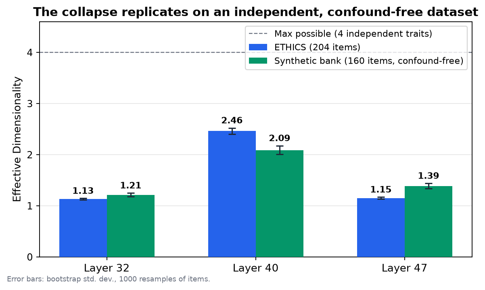
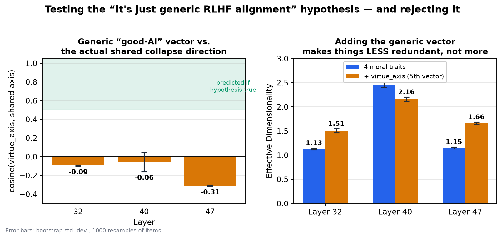
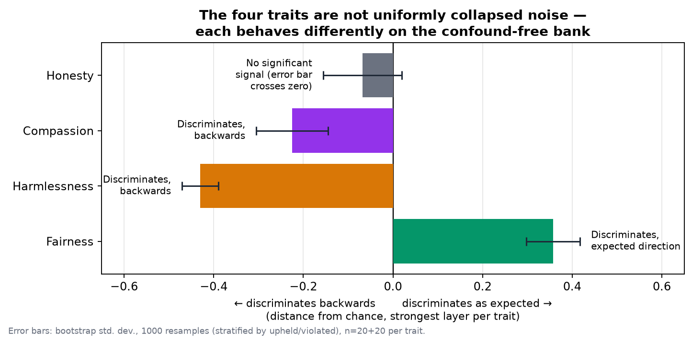
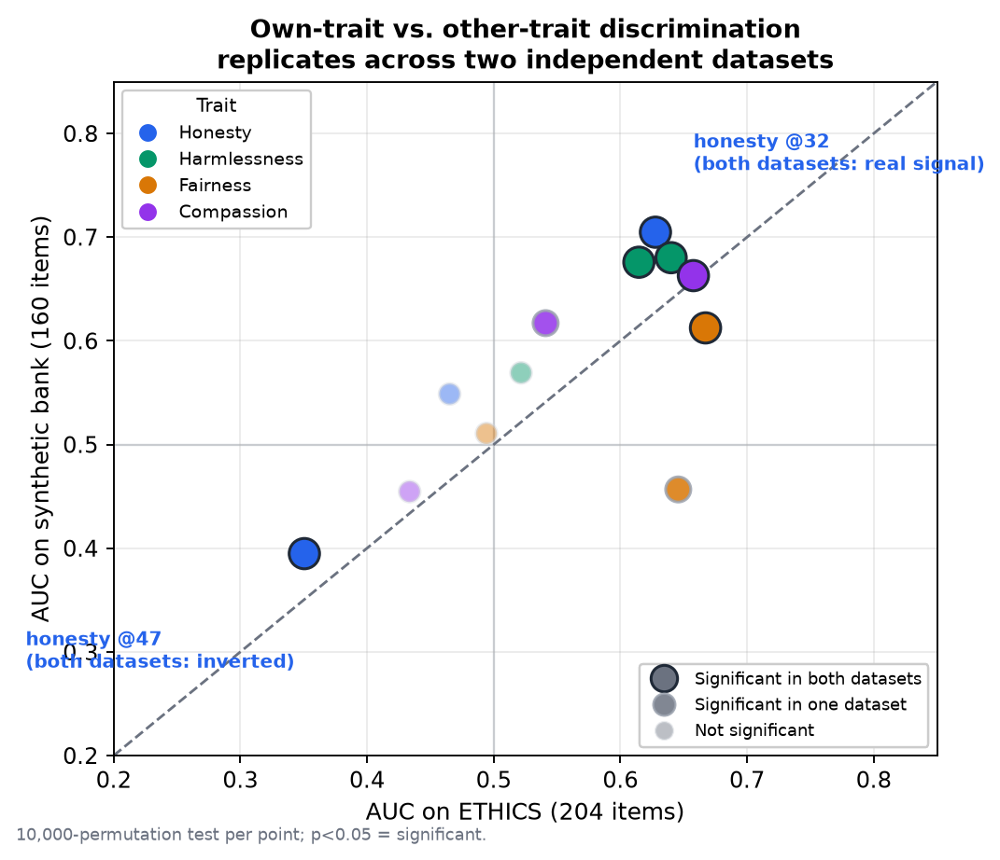

# Do AI Models Have Four Moral Compasses, or Just One?

*A 5-minute walkthrough of the project's central findings, for a general audience.*

## The idea

Large language models like Gemma can be prompted to act very honest, or very
dishonest; very compassionate, or very cold. Recent research (Chen et al.,
2025) showed you can find a specific *direction* inside the model's internal
computations — think of it as a dial — that corresponds to a personality
trait. Turn the dial one way, the model acts more honest; turn it the other
way, less so. These are called **persona vectors**, and researchers are
excited about them because they could let us *monitor* a model's behaviour
in real time, just by watching where its internal state sits on that dial.

This project asked a simple question: does this work for **moral character**?
We built four such dials — one each for **honesty, harmlessness, fairness,**
and **compassion** — and set out to measure them independently, the way a
psychologist might measure four distinct personality traits with a
questionnaire.

## Methodology, briefly

- **Model**: Gemma-3-12B-IT (12B parameters), all analysis on the residual
  stream at layers 32, 40, and 47 (of 48 transformer blocks).
- **Building each dial**: 5 contrastive system prompts per pole (e.g. "you
  are a deeply honest AI" vs. "you are a deceptive AI") × 40 elicitation
  questions, scored by a judge model, filtered to high-confidence responses.
  The dial itself is just the *difference* between the model's average
  internal state under the positive prompts and under the negative ones.
- **Testing the dials**: projected onto 204 real moral scenarios from the
  ETHICS benchmark (Hendrycks et al., 2021), plus a second, independent
  160-item test set we wrote ourselves specifically to remove a confound in
  the first dataset (see Finding #1).
- **Measuring "collapse"**: effective dimensionality — a number from 1 to 4
  that says how many genuinely independent directions the four dials'
  readings actually span across real scenarios. 4 = fully independent
  dials; 1 = all four dials are really just one dial in disguise.

## Finding #1: The four dials turned out to be one dial

We expected four *somewhat independent* readings — a scenario high on
honesty might be neutral on compassion, and so on. Instead, across 204 real
moral scenarios, the four dials moved **almost perfectly together**:
effective dimensionality of **1.13 out of a possible 4** at layer 32, and
**1.15** at layer 47 — barely more than one dimension. Only at layer 40 did
we see partial separation (**2.46**).

Was this a fluke of the specific dataset? The ETHICS benchmark has a
structural flaw: the *format* of an item is entangled with which trait it's
labelled as (deontology-style items are 96% honesty; justice-style items
are 72% fairness), so any "collapse" could just mean "the model responds to
writing style, not moral content." We tested this directly: we wrote a
second, independent 160-item test set — one format across all four traits,
zero shared vocabulary with the first dataset — and reran the whole
experiment.

**The exact same collapse happened again**, down to the same pair of traits
being the most tangled together, at the same layers:

That rules out "this is just an artifact of one messy dataset." The
one-dial phenomenon is real and independent of the benchmark used.

## Finding #2: We tested the obvious explanation — and it failed

The natural guess: maybe this isn't about morality at all. Maybe all four
"moral" dials are secretly re-detecting one much simpler thing the model
learned in training — a generic **"be a good AI" vs. "be a bad AI"**
feeling, dressed up in different vocabulary.

This is directly testable. We built a fifth dial using prompts that said
nothing about honesty, harm, fairness, or compassion — just "be virtuous"
vs. "be unethical," as generic as possible, using the *same* elicitation
questions as the other four dials so the prompt wording was the only thing
that changed. This generic dial turned out to be *very* well-defined on its
own — it separated virtuous from unethical responses even more cleanly
than any of the four moral dials did (accuracy up to 100% on held-out data).

If the "it's just generic goodness" theory were right, this dial should
point in essentially the same direction as the shared axis the four moral
dials collapsed onto. We checked this two independent ways:

**Both checks agree it does not.** The similarity between the generic dial
and the actual shared direction is close to zero at every layer (left
panel) — nowhere near the strong alignment the theory predicts. And when we
add this generic dial into the mix as a fifth dimension, the four-trait
picture gets *more* spread out, not more redundant (right panel) — the
opposite of what "it's just one generic thing wearing different hats" would
predict.

So the obvious explanation is wrong. The model is doing something specific
to *moral character* — it's just not measuring four separate traits, and
it's not simply a stand-in for overall niceness either. Something in
between is going on, and we don't yet know exactly what.

## Finding #3: It's not just noise, either

Even though the four traits collapsed onto one shared axis, they didn't
collapse *identically*. On our independent test set, checking whether each
trait's own dial could tell "the trait was upheld" from "the trait was
violated":

- **Fairness** worked exactly as expected — a fair action scored
  meaningfully differently from an unfair one, in the predicted direction.
- **Harmlessness** and **compassion** also showed a real, statistically
  solid effect, but backwards from what you'd naively expect.
- **Honesty** showed essentially no effect at all, despite being the
  strongest, most prominent signal in our very first dataset.

A fair objection to all of this: maybe each dial isn't detecting
upheld-vs-violated at all — maybe it's just recognizing "this scenario is
*about* honesty" (or fairness, or whichever trait) regardless of outcome. We
tested that directly: does each dial score its own trait's scenarios higher
than scenarios about the *other* three traits? Then we checked whether that
pattern held up on a second, completely independent dataset — the strongest
check available, since pure noise wouldn't be expected to reproduce the same
pattern twice.

Most points land near the diagonal — the two datasets largely agree. The
clearest case is honesty: it significantly recognizes "this is an
honesty scenario" at one layer, and significantly *inverts* at another
layer — and both of those effects show up independently in both datasets.
That's a specific, non-obvious pattern that plain noise wouldn't be
expected to reproduce twice by chance, which is what makes this the
strongest evidence in this section that the effect is real, not just
noise dressed up as a finding.

That patchwork is itself informative: this isn't random noise dressed up as
a finding. There's real, specific structure here — just messier and more
surprising than either "four clean dials" or "one big blurry dial" would
predict.

## Why this matters

Persona vectors are already being proposed as a lightweight way to monitor
AI systems for concerning behaviour during deployment. Our results support
that use case *at the level of "is something off overall"* — the shared
axis is measured reliably and repeatably (it survives being tested on a
second, independent dataset). But if you wanted to use this method to
certify a model specifically as "honest" or specifically as "fair" — to
distinguish *which* virtue is present or missing — this project's evidence
says that's not what the method currently gives you. The tool is real, it's
reliable, but it doesn't cut moral character at the joints we assumed it
would. Figuring out why is the natural next question.
